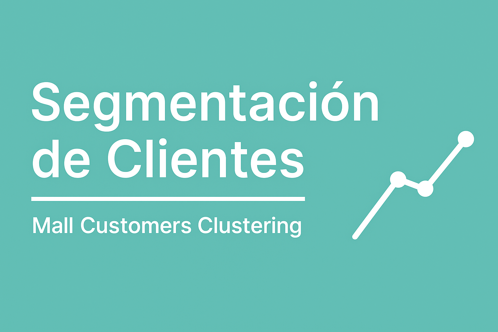
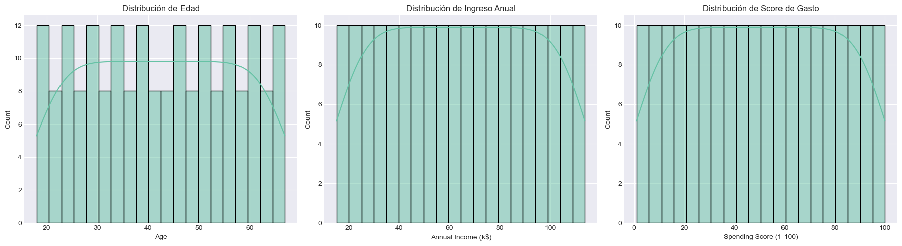
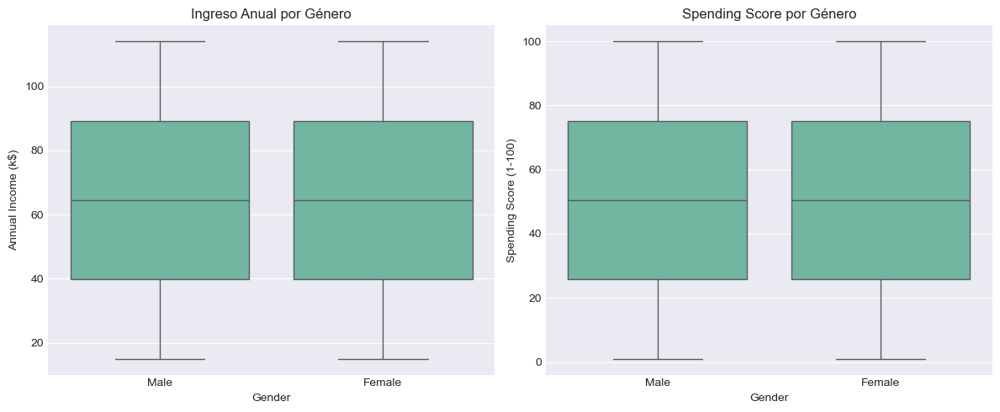
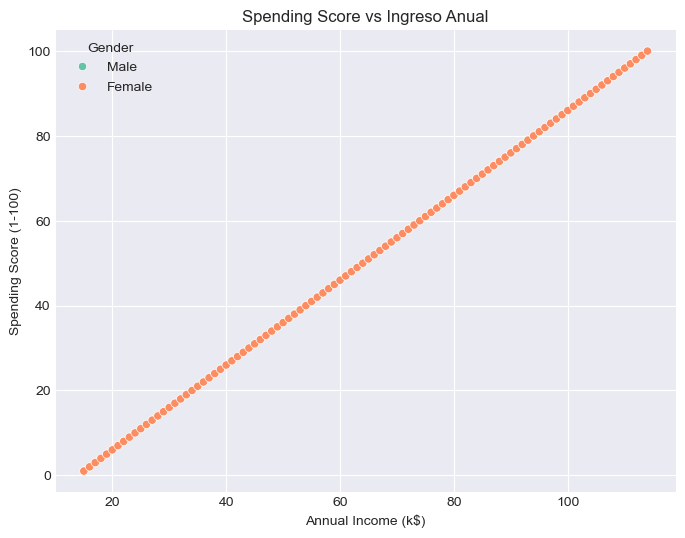
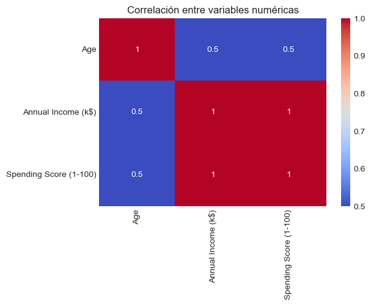
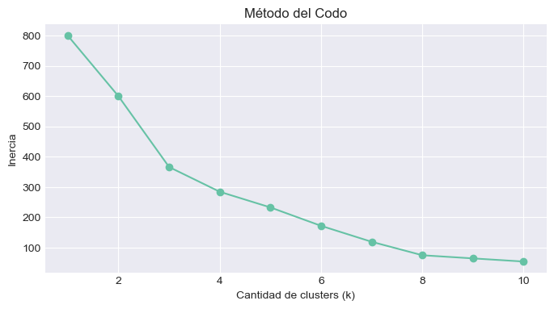
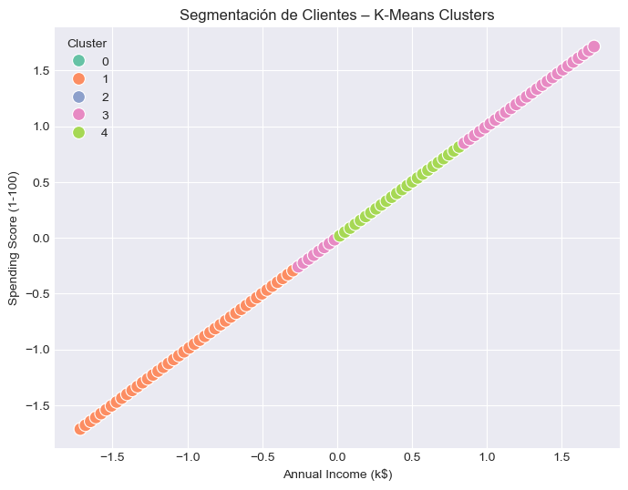
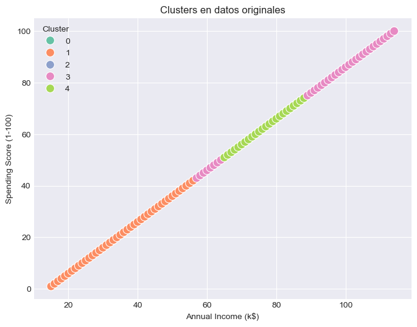
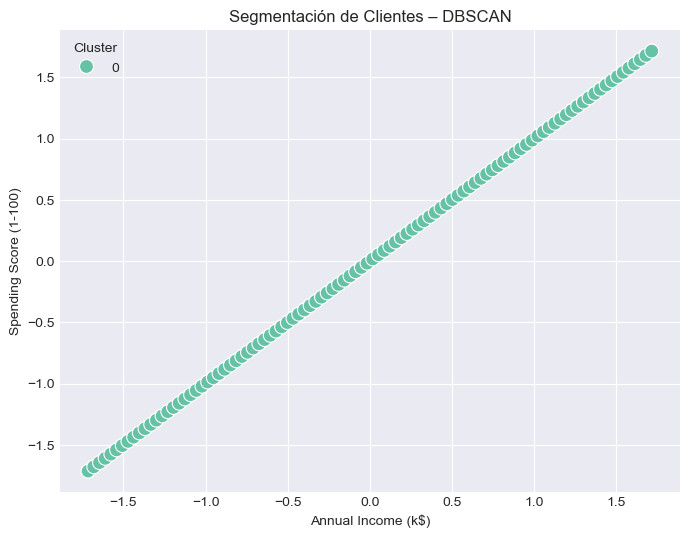

# Segmentación de Clientes – Mall Customers

<p align="center">
  
</p>

## 🧠 Objetivo

Aplicar técnicas de aprendizaje no supervisado para segmentar clientes en grupos con características similares, a partir de variables sociodemográficas y de comportamiento. Esta segmentación permite a las empresas optimizar campañas de marketing y tomar decisiones estratégicas más personalizadas.

---

## 📁 Estructura del repositorio
```markdown
clustering-clientes/
├── clustering_clientes.ipynb # Notebook principal
├── README.md # Descripción del proyecto
├── requeriments.txt # (opcional) Librerías necesarias
├── .gitignore # Ignora archivos temporales y de entorno
└── /images # Gráficos y visualizaciones
```

---

## 📊 Dataset

El dataset contiene información de clientes de un shopping, con las siguientes variables:

- **CustomerID**: Identificador único del cliente  
- **Gender**: Género del cliente  
- **Age**: Edad del cliente  
- **Annual Income (k$)**: Ingreso anual en miles de dólares  
- **Spending Score (1-100)**: Puntuación de gasto (comportamiento de consumo)

---

## 🧪 Técnicas aplicadas

- Exploración y visualización de datos (EDA)
- Preprocesamiento:
  - Eliminación de columnas irrelevantes
  - Codificación de variables categóricas
  - Escalado de datos
- **Clustering con K-Means**
  - Método del Codo
  - Silhouette Score
- **Comparación con DBSCAN**
- Visualización e interpretación de segmentos

---

## 📌 Análisis exploratorio (EDA)

Visualizamos las variables para entender su distribución y relaciones:


*Distribución de Edad, Ingreso y Score de Gasto*


*Distribución por género del ingreso y el score de gasto*


*Relación entre Ingreso y Score de Gasto*


*Correlación entre variables numéricas*

---

## 📈 K-Means Clustering

### 🔹 Método del Codo

Se identificó que **k = 5** es una buena elección:



### 🔹 Visualización en espacio escalado



### 🔹 Visualización en valores originales



---

## 🧪 Comparación con DBSCAN



| Aspecto           | K-Means             | DBSCAN                             |
| ----------------- | ------------------- | ---------------------------------- |
| Requiere k        | ✅ Sí                | ❌ No                               |
| Detecta ruido     | ❌ No                | ✅ Sí (puntos -1)                   |
| Forma de clusters | Esférica o circular | Arbitraria (más flexible)          |
| Sensibilidad      | A outliers y escala | A valores de `eps` y `min_samples` |

---

## 🧩 Conclusión

El modelo de clustering con K-Means permitió identificar **5 segmentos diferenciados de clientes** en función de su ingreso anual y score de gasto. Estos grupos ofrecen un marco útil para:

- Diseñar campañas personalizadas según el perfil de consumo.
- Detectar clientes de alto valor vs bajo potencial.
- Mejorar la experiencia del cliente con estrategias más segmentadas.

Si bien K-Means ofreció resultados más interpretables y visuales, **DBSCAN no logró diferenciar clusters** en este dataset debido a la forma lineal de los datos y la baja densidad diferenciada. Esto resalta la importancia de elegir el algoritmo adecuado según la naturaleza de los datos.

---

## 🧪 Librerías utilizadas

- pandas
- numpy
- matplotlib
- seaborn
- scikit-learn

---

🔗 Proyecto realizado por [Matías Vallone](https://github.com/ValloneMatias)
